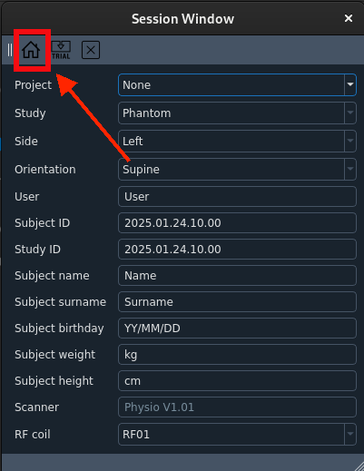
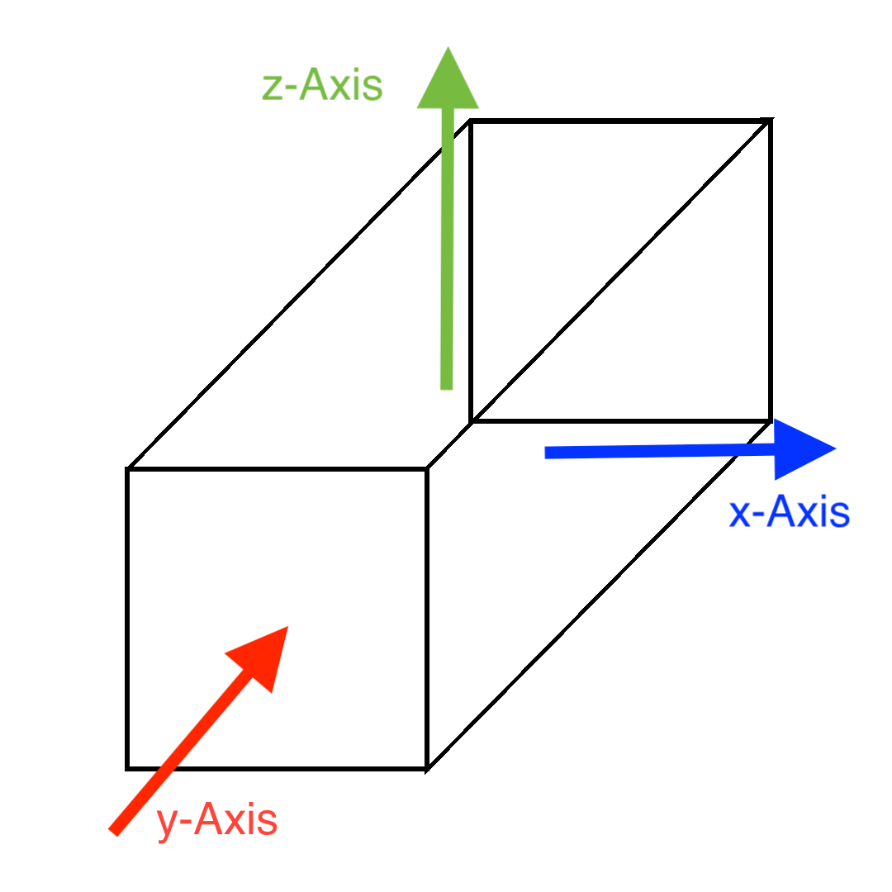

# Get started with MaRGE and produce the first scans

To produce the first scans using MaRGE, one has to follow these steps.

### 1. Start MaRGE software  
#### 1.1 Navigate into the MaRGE folder
```
cd home/MRI/MaRGE
```

#### 1.2 Activate the Virtual Environment
```
source ./venv/bin/activate
```

#### 1.2 Start the python script
```
python3 main.py
```


### 2. Fill in data from one's phantom  
One can also leave this form without entries.


### 3. Start the main window  
Press the house symbol.  



### 4. Connect and Initialise RedPitaya  

#### 4.1 MaRCoS init  
First, press "marcos init."  
  
A terminal window with the message "Copying bitstream..." should pop up and close again shortly after.  
  

#### 4.2 MaRCoS server  
Then, press "MaRCoS server."  
  

Again, a terminal window will pop up and close again.   
  

On the left side, in the console section, one will see a message like `READY: Server connected!`.

#### 4.3 Init power modules  
Lastly, press "Init power modules."  
This will enable the GPA.  
  
A message `READY: GPA init done!` will appeear in the console. Also, one will hear a sound from the sund simulator.


### 5. Perform Autocalibration and Localizer Sequences  
First, it is recommended to perform an autocalibration. This will include a Lamor Frequency check, a Rabi Flops Sequence, and noise measurement. One does not need to worry about the error message from the AutoTuning Sequence — this is not required.  

  
In addition, a Localizer Sequence will help to produce scans of higher quality.  


### 6. Run Sequences
Now, every sequence can be run by selecting from the dropdown menu on the left side and press the `Acquire` button.  


## Axes orientation:
Inside the sequences, there is always this section `Axes [rd, ph, sl]`.
Here, one can define what type of scans gets created.  
The axes of the MRI are orientated this way:  
  
This means, one has to select certain axes as slicing axes (put in the last position inside the brackets -> "sl") to get these type of scans:  

| Scan Type   | Slicing Axis   | variable   |
|------------|------------|------------|
| Coronal  | X  | 0  |
| Transversal  | Y  | 1  |
| Saggital  | Z  | 2  |

For example, to produce a transversal scan, the Axes input could look like this: `[2, 0, 1]`


## Troubleshooting Common Issues  

### Software does not respond
If during a sequence, the window `main.py is not responding` pops up, this is not a problem. During some sequences the threading is too slow and then the GUI is not responsive, which results in this error message. However, as soon as the sequence is finished this window should close and the the GUI will be responsive again.

### No gradient output
If no gradients can be seen, try pressing "Init power modules" again. Sometimes the initiation does not work right at the first try, so doing this 2-3 times will solve this problem.


### No larmor frequency
The larmor frequence should be at around 16.55-16.65 MHz depending on the temperature in the room.  
If no larmor can be found, try starting at one of these frequencies and run the sequencies iterative, by clicking the button right next to the `Acquire` button (The double error symbol) befoire clicking `Acquire`.  
  

This will run the squence as long as one stops it and therefore may find the larmor frequency faster.   
One can also adjust the parameters and check with a higher bandwith for example. 

In addition, check if by accident the shimming vector has changed. It should be by default at `[10.0, -10.0, 10.0]`.  
The shimming sequence should NOT be run, as this will just set the shimming values to the boundaries of the range.

