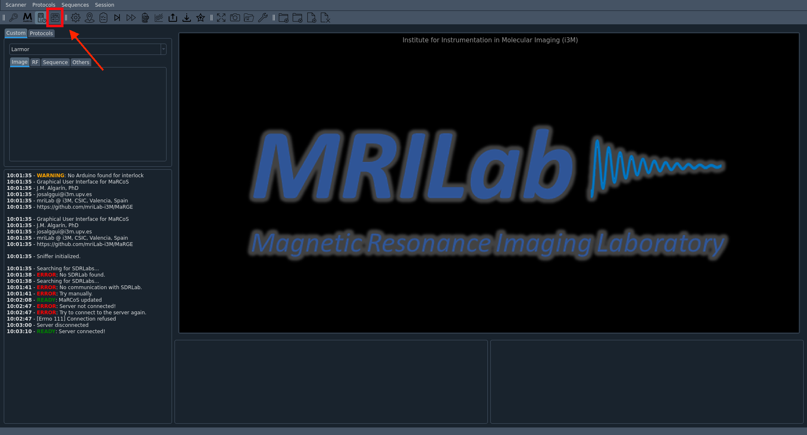

# Get started with MaRGE and produce the first scans

To produce the first pictures using MaRGE, one has to follow these steps.

### 1. Start MaRGE software  
#### 1.1 Navigate into the MaRGE folder
```
cd home/MRI/MaRGE
```

#### 1.2 Activate the Virtual Environment
```
conda activate marge
```

#### 1.2 Start the python script
```
python3 main.py
```

### 2. Fill in data from one's phantom  
One can also leave this form without entries.

### 3. Start the main window  
Press the house symbol.  


### 4. Connect and Initialise RedPitaya  

#### 4.1 MaRCoS Init  
First, press "marcos init."  
  
A terminal window with the message "Copying bitstream..." should pop up and close again shortly after.

#### 4.2 MaRCoS Server  
Then, press "MaRCoS server."  
  

Again, a terminal window will pop up and close again.  
On the left side, in the console section, one will see a message like `blablabla`.

#### 4.3 Init Power Modules  
Lastly, press "Init power modules."  
This will enable the GPA.  


### 5. Perform Autocalibration and Localizer Sequences  

First, it is recommended to perform an autocalibration. This will include a Lamor Frequency check, a Rabi Flops Sequence, and noise measurement. One does not need to worry about the error message from the AutoTuning Sequence — this is not required.  

  
In addition, a Localizer Sequence will help to produce pictures of higher quality.  


## Troubleshooting Common Issues  
TODO  
