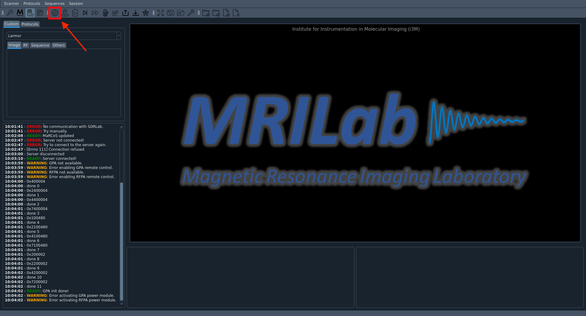

# Get started with MaRGE and produce the first pictures

To produce the first  pictures using MaRGE, one has to follow these steps.

### 1. start MaRGE software:  
#### 1.1 navigate into MaRGE folder

```
cd home/MRI/MaRGE
```
#### 1.2 activate virtual environment
```
conda activate marge
```
#### 1.3. start main.py file
```
python3 main.py
```
### 2. Fill in data from your phantom
One can also leave this form without entries.

### 3. Start main window
Press onto the house symbol.  


### 4. Connect and initialise RedPitaya

#### 4.1. MaRCoS init
First, press "marcos init"  

A terminal window whith the message "Copying bitstream..." should pop up and close again shortly after.

#### 4.2. MaRCoS server
Then, press "MaRCoS server"


Again, a terminal window will pop up and close again.  
On the left side in the console section one will see a message like `blablabla`.

#### 4.3. Init power modules
Last, press "Init power modules".
This will enable the GPA.


### 5. Do Autocalibration an Localizer Sequences

First, it is recommended to do an autocalibration, this will include a Lamor Frequence check, as well as an Rabi Flops Sequence and a noise measuring. One does not have to worry about the error mesaage from the AutoTuning Sequence - this is not needed.  



In addition, a Localizer Sequence will also help to get pictures of higher quality.  


## Troubleshooting common issues.
TODO
