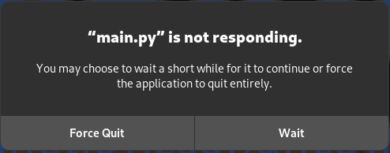

# Bug Report MaRGE

When working with the software weh came across some very interesting bugs regarding the MaRGE software.

## 1. App crashes during sequences

When running a more complex sequence in the app (e.g., `mse_jma`, `TSE`, `GRD3D`, etc.), a pop-up window appears with the message `main.py is not responding` (see Attachment 1)

Despite this, the sequence appears to continue running, as observed on the oscilloscope, regardless of whether `Wait` is selected or the pop up window is just left open. If one close the window, the pop-up reappears within 5 seconds. Once the sequence completes, the app resumes normal functionality, and the pop-up no longer appears. The data also seems to be processed correctly, as the resulting images are displayed and match the phantom patterns as expected.

Over time, however, a different issue arises where certain sequences can no longer be initiated. For example, after running several GRD3D sequences in succession, attempting to start an mse_jma sequence results in no observable action apart from the aforementioned pop-up window appearing again. Notably, no output is visible from the DACs on the oscilloscope in this case.

Interestingly, if `Force Quit` is selected at this stage, the sequence eventually starts and is visible on the oscilloscope.

## 2. Shimming sequence does not work

TThe shimming sequence does not work at all. After running the sequence, the outputs are usually set to the last value shown in the sequence, and this value is completely wrong. 

If we do the shimming manually (by running a continuous Lamor sequence and setting the shimming so that the peak value is as high as possible) and then run the sequence, we would expect the shimming to be set at around [0, 0, 0]. However, the values are again set to values at the limits of the shimming range, for example [-50, 50, -50].

We have observed the shimming process on our oscilloscope, and even if the correct value we expect is exceeded, the software sets the shimming to a completely different value.

## 3. Offset after gradient
***Disclaimer: I am not sure if this is a problem that affects MaRGE or if the cause lies with marcos himself.***

During the gradient tests, we noticed that they immediately pushed the gradient amplifier to its limits, resulting in a significant offset. Despite various shimming sequences and manual shimming, it was not possible to fully resolve this issue.

Further tests revealed that the DACs activate an offset when the amplifiers are turned on.

### 3.1 Changes in `grad_board.py`

The configuration of the DAC values is handled in the file `marcos_client/grad_board.py`, starting from line 105. It turned out to be beneficial to change the order of the commands:
- **Before:** Turn on the amplifiers first, then set the outputs to 0.  
- **After:** Set the outputs to 0 first, then turn on the amplifiers.  

We swapped line 110 with line 109 to implement this adjustment.  

The commands are written in hexadecimal and address the individual registers of the DACs. For more details, see the DAC datasheet ([Datasheet](https://www.analog.com/media/en/technical-documentation/data-sheets/AD5781.pdf), from page 19).

The offset only appears with the final command (`0x07200002`); prior to this, the system is perfectly set to 0. However, if this command is omitted, gradients cannot be generated using either `examples.py` or `MaRGE`.  

By manually adjusting the offset (e.g., setting it to 200 instead of 0 → `0x04100200`), we observed improvements. However, the offset reappeared as soon as a gradient was activated.

### 3.2 Hardware Adjustment: Voltage Divider

To reduce the offset, we introduced a 10:1 voltage divider. At the same time, we adjusted the gradient amplification (`gFactor`) in the MaRGE configuration file (`hw_config.py`) by a factor of 10 to maintain previous results.  
- Example:  
  - **Before:** `gFactor` = 0.05  
  - **After:** `gFactor` = 0.005  
  - Similar adjustments were made for other values (e.g., 0.035 → 0.0035).

## 4. Environment

We use a RedPitaya and an OCRA1 Board.
These Bugs occur equally with two different computers:
- ThinkPad L570 with 8Gb RAM and an Intel Core i7-7500U x 4 (Linux Debian 12)

- MacBook Air (2022) with 16Gb RAM and a M2 Chip (macOS Sonoma 14.5)

## 5. Attachments

#### Pop Up Window  

#### Current config file
[hw_config.py](hw_config.py)